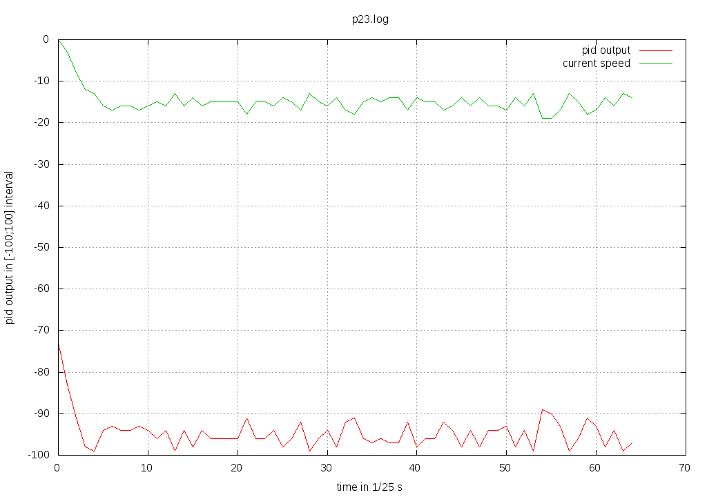
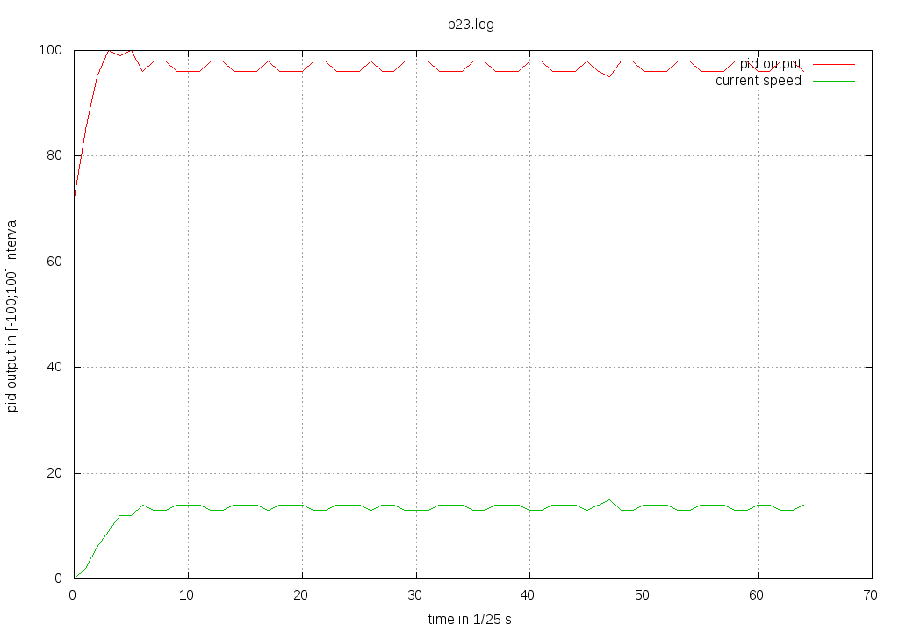
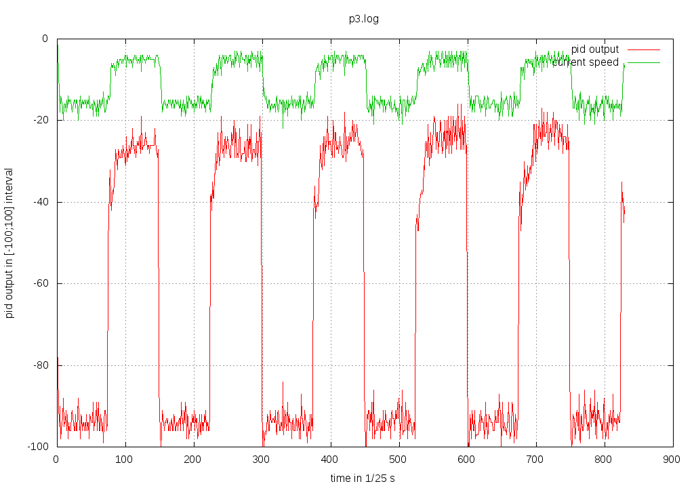
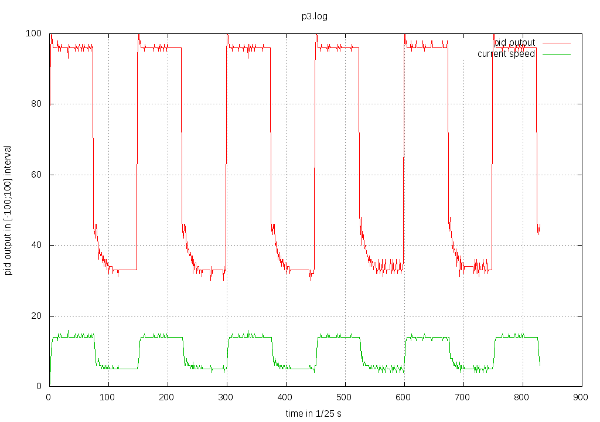
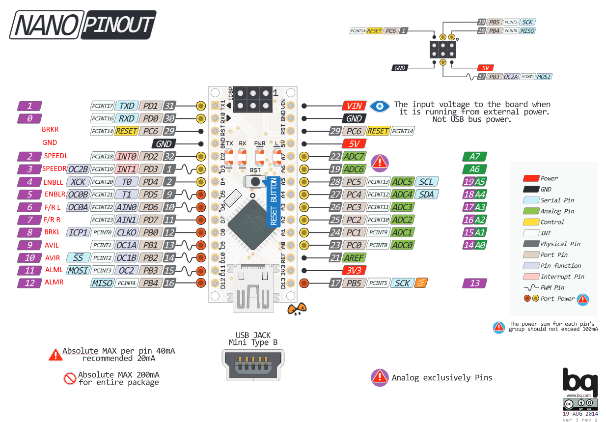

robot_p
=======

ROS software stack for a custom robot


controller
----------
communicates via serial
- 57600 BAUD
- 8 data bits
- none parity
- 1 stop bit
- none handshaking

### INPUT ROS (OUTPUT controller)

6 byte message

```
T <16 bit signed> <16 bit signed> <CRC-8>

  left wheel        right wheel
```
ticks from previous message - one turn should have 257.8 ticks

```
ALM_L <CRC-8>
ALM_R <CRC-8>
```
left (right) driver sent ALM signal, controller is now in stopped state

### OUTPUT ROS (INPUT controller)

6 byte message

```
[PID] <32 bit unsigned> <CRC-8>

        float * 32 
```

```
V <16 bit signed> <16 bit signed> <CRC-8>

   left wheel       right wheel
```


```
STOP\0 <CRC-8>
```
all timers stop and ENBL is set to 1 

```
START <CRC-8>
```
all timers start and ENBL is set to 0 

### Documentation
Since base unit for atmel328P is 1 byte processor can not deal for example with int atomically. Thus there can be race condition between main "thread" and interrupts. By default interupts can not be interrupted by another one. Interrupts are waiting until they are processed. 

There is basically no code in main "thread" unless initialization. All the job is done in interrupts from timers, usart or pin value change interrupts. Thus there should not be danger of race conditions.

#### Timers
Controller uses following two timers:

*   TC1 - 16 bit - Generates PWM at frequency 1 kHz. 
*   TC0 - 8 bit - Generates interrupts at frequency 125 Hz. Following rutines are executed in every 5th interrupt thus 25 Hz.
   *   current speed transmission to ROS
   *   PID update computation
   *   rotation direction set according to PID output
   *   PWM duty cycle updated according to PID output

#### PID

*   P,I,D variables are multipled by 32 thus in PID algorithm divided by 32=2^5 (shift can be used instead)
*   PID uses as dt = 1 where 1 is in units of 1/25 s thus one unit of time is one measure-timer interrupt
*   PID output and integral is clamped to [-100;100] interval which is appropriate interval for pwm gneratin

##### Current PID values

```
speed_t pid_p = 50; //effectively 1.56
speed_t pid_i = 23; //effectively 0.71
speed_t pid_d = 4; //effectively 0.125
```
PID behaivour with top speed:




PID behaivour when changing top speed to slow speed every 3 seconds:





#### Usart
All reception is done in reception interrupt thus there is no active wating for incoming messages. Transmisson method call is always "synchronous". (whole message has to be sent to leave function)

#### Simple External interrupts
There are two pins INT0/1 allowing to call interrupt when pin value is changed. These two pins are connected to SPEED signals and interrupt event is set to raising edge.

#### Other External interrupts
Value change interrupt can be set to almost all pins. Nevertheless this method is less user friendly, because you have to manually determine whether some pins are changed or not. This method is used for pins PB3/4 to detect ALM signal.


#### Pinout

