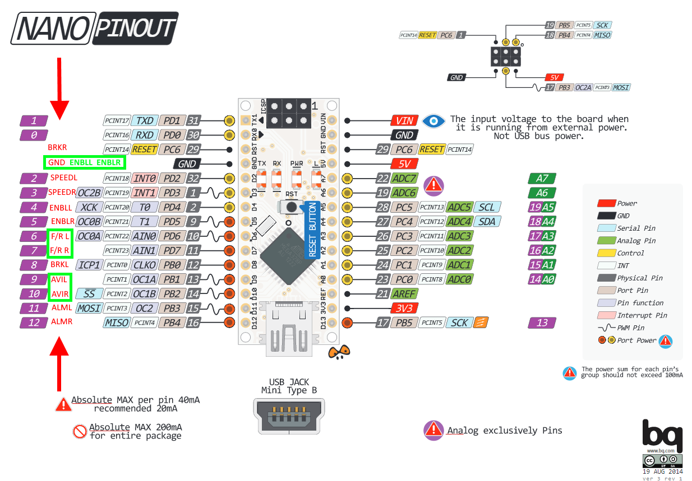

robot_p
=======

ROS software stack for a custom robot

URDF
----------

TODO

ROS control
----------

TODO

Controller
----------


### demo_controller (in use)

This controller is writen in Arduino and is currently in use.  Controller periodically reads messages from ROS containing pwm power in range [-255;255]. Appropriate pwm and forward / rear signal is then generated to motor drivers. Sources are located in demo_controller folder.

### robot_p_controller (future use)

This controller is written directly in AVR and supports all features of motor drivers. Nevertheless motor drivers generate SPEED signals in too high frequency thus controller is not able to read all of them. This implementation is thus meant for future development - hardware solution to decrease frequency of SPEED signal is needed. Sources are located in robot_p_controller folder.

### Documentation

Following sections are meant essentially for robot_p controller. If content is relevant also for demo controller it is directly specified.


#### Pinout

Labels in red describe pin connected with drivers.

Labels in green font or box describe demo controller pins connected with drivers. (relevant for demo controller)




#### Serial configuration

Valid also for demo controller.

ROS communicates with controller via serial with following configuration.
- 57600 BAUD
- 8 data bits
- none parity
- 1 stop bit
- none handshaking

#### INPUT ROS (OUTPUT controller)

6 byte message

```
T <16 bit signed> <16 bit signed> <CRC-8>

  left wheel        right wheel
```
ticks from previous message 

```
ALM_L <CRC-8>
ALM_R <CRC-8>
```
left (right) driver sent ALM signal, controller is now in stopped state

#### OUTPUT ROS (INPUT controller)

6 byte message

```
[PID] <16 bit unsigned> <CRC-8>

        float * 32 
```

```
V <16 bit signed> <16 bit signed> <CRC-8>

   left wheel       right wheel

```
   demo controller: values are in the range [-255,255] (valid also for demo controller)

   robot_p controller: values are speed in ticks per iteration (because of PID controller)


```
ETOP\0 <CRC-8>
```
all timers stop and ENBL is set to 1 


```
START <CRC-8>
```
all timers start and ENBL is set to 0 

this message has to be sent before any other

#### Atmega328P notes

- Since base unit for atmel328P is 1 byte processor can not deal for example with int atomically. Thus there can be race condition between main loop and interrupts. By default interupts can not be interrupted by another one. Interrupts are waiting until they are processed. 

- full data sheet -> http://ww1.microchip.com/downloads/en/DeviceDoc/Atmel-42735-8-bit-AVR-Microcontroller-ATmega328-328P_Datasheet.pdf

- summary -> http://ww1.microchip.com/downloads/en/DeviceDoc/Atmel-42735-8-bit-AVR-Microcontroller-ATmega328-328P_Summary.pdf

- arduino nano pinout -> http://www.pighixxx.com/test/pinouts/boards/nano.pdf

- flashing .hex file -> https://forum.arduino.cc/index.php?topic=410618.0


#### Timers
Controller uses following two timers:

*   TC1 - 16 bit - Generates PWM at frequency 1 kHz. 
*   TC0 - 8 bit - Generates interrupts at frequency 125 Hz. Following rutines are executed in every 5th interrupt thus 25 Hz.
   *   current speed transmission to ROS
   *   PID update computation
   *   rotation direction set according to PID output
   *   PWM duty cycle updated according to PID output


#### Usart
All reception is done in reception interrupt thus there is no active wating for incoming messages. Transmisson method call is always "synchronous". (whole message has to be sent to leave function)

#### External interrupts
There are two pins INT0/1 allowing to call interrupt when pin value is changed. These two pins are connected to SPEED signals and interrupt event is set to raising edge. 

To let this work there has to be created external pull ups by connecting desired pin and 5V using resistor!

#### Other External interrupts
Value change interrupt can be set to almost all pins. Nevertheless this method is less user friendly, because you have to manually determine whether some pins are changed or not. This method is used for pins PB3/4 to detect ALM signal.


#### PID

*   P,I,D variables are multipled by 32 thus in PID algorithm divided by 32=2^5 (shift can be used instead)
*   PID uses as dt = 1 where 1 is in units of 1/25 s thus one unit of time is one measure-timer interrupt
*   PID output and integral is clamped to [-100;100] interval which is appropriate interval for pwm gneratin

##### Current PID values

```
speed_t pid_p = 50; //effectively 1.56
speed_t pid_i = 23; //effectively 0.71
speed_t pid_d = 4; //effectively 0.125
```
##### PID tests

PID behaivour with top speed:


PID behaivour when changing top speed to slow speed every 3 seconds:


